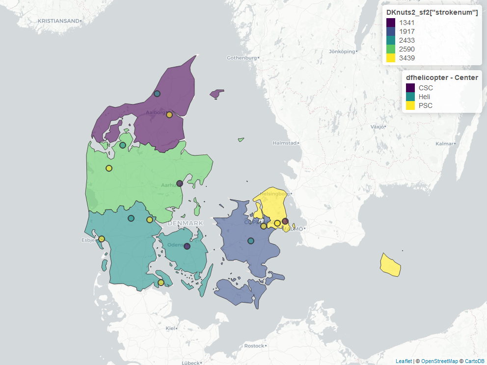
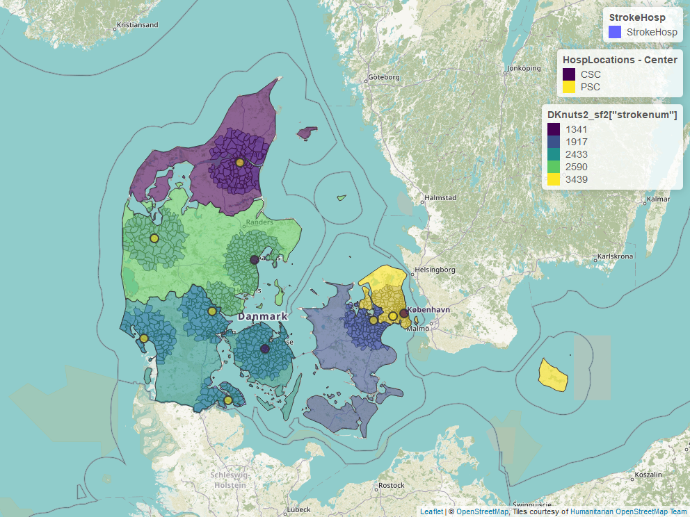

# DENMARK-lvostroke
This is a documentation of the progress for the project
It uses the following packages: eurostat, dplyr, sf and mapview. Mapview provides interactive map view using leaflet. The geocoding of the hospital is performed using geocode_OSM function from tmaptools. 

Codes: 
This project is written with codes adapted from https://richardbeare.github.io/GeospatialStroke/. 

Population data: 
Data on population in Denmark can be obtained at this link. https://www.statbank.dk/INDAMP01. The statbank population data is not in tidy data format as it is collected with one row for each kommune follow by a line for total population, a line below for men and a line below for women.

Shapefile: 
The shapefile for the NUTS2 and NUTS3 can be obtained from eurostat package in R. The shapefile from the 99 kommune can be obtained at this site https://ec.europa.eu/eurostat/web/gisco/geodata/reference-data/administrative-units-statistical-units/communes. 

Address:
The Danish address registry is available at https://eng.sdfe.dk/product-and-services/the-danish-address-register/. This data is compiled in geojson format using fetchstuff.R and takes a very long time to run. the data is stored in GeoJSON folder in your computer as a file labelled kommune_addresser.Rda. It is approximately 436 MB and so is not uploaded to github.

Hospital data:
The data for the hospitals in demark (HospLocations.Rda) contains comprehensive stroke unit (CSC) and primary stroke centre (PSC). 

Helicopter:
The data for the helicopter locations are available in HeliLocations.Rda.

Stroke frequency:
The stroke frequency data is obtained from Dansk Apopleksiregister Årsrapport 2018. Converting the data from pdf to xcel format can be difficult due to the use of Danish characters. This is done using excalibur-py. see the file pdftables.R. There are 2 xcel files: one is labelled 4669_dap_aasrapport.xlsx and denmarkstrokepdf.csv. The denmarkstrokepdf.csv has been edited with regards to Dabish characters.

Street network:
This file streetnetwork.R is still under development.

Google Maps API:
plan to sample 50 random addresses from each kommune.

The map below contains data on number of stroke in 2018 within each NUTS2 region and 30 mkm catchment of each hospital.

